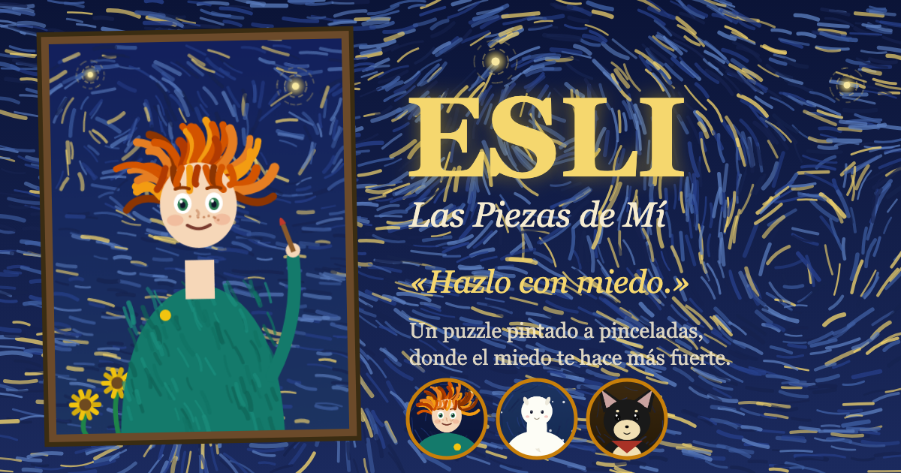
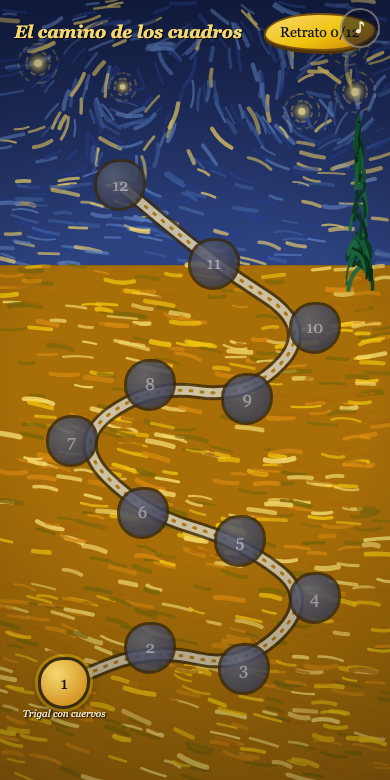
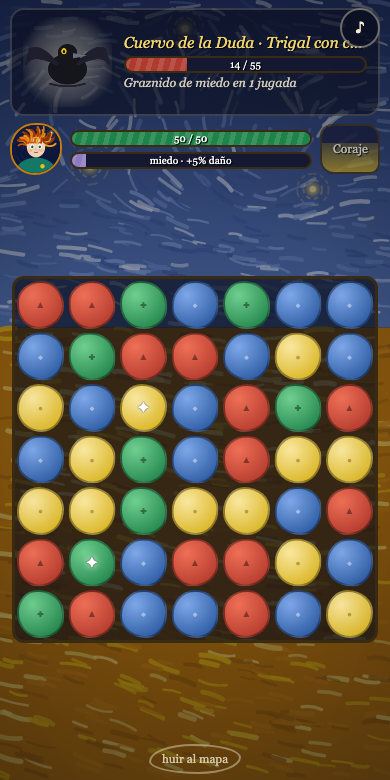
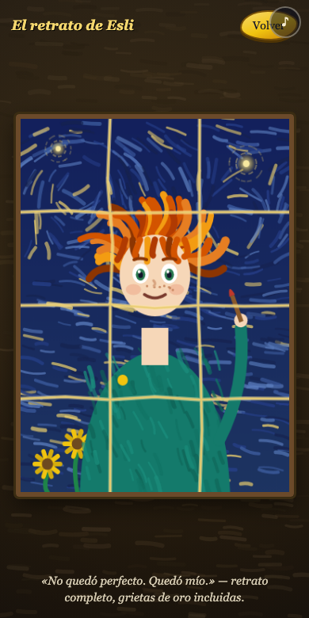

<p align="center"></p>

# Esli — Las Piezas de Mí

> **«Hazlo con miedo.»**

Esli le tiene miedo a casi todo: a los cuervos, a las críticas, a las cobijas
demasiado cómodas. Una noche, la Niebla Gris se bebió los colores de su taller
y rompió su autorretrato en doce pedazos. Esli va a ir por ellos. Temblando,
pero va.

**[▶ Jugar ahora](https://esli.vercel.app)** — gratis, sin anuncios, sin
registro, ~110 KB. Corre hasta en el cel más humilde.

| El camino | La batalla | El retrato |
|:---:|:---:|:---:|
|  |  |  |

## Por qué se siente distinto

- **El miedo es tu arma.** Cada golpe que recibes sube tu barra de miedo — y
  tu daño con ella, hasta +75%. No esperas a que se te quite: pegas con él.
  La mecánica es la moraleja.
- **Compañía pequeña y feroz.** Annie, alpaca bebé blanca que abriga (escudo
  de lana). Chiquis, chihuahua de veinte centímetros que no le teme a nada de
  más de veinte centímetros (su ladrido retrasa al monstruo).
- **Doce cuadros, doce miedos.** Del *Trigal con cuervos* a *La noche
  estrellada* y el *Almendro en flor*: cada nivel es un homenaje a Van Gogh y
  cada jefe un miedo con voz propia — la Duda trae lista por escrito, la
  Cobija te dice «cinco minutitos más».
- **Final kintsugi.** El retrato no queda perfecto: queda con grietas de oro.
  Ese es el punto.

## Por dentro

- **HTML + CSS + JS vanilla. Cero dependencias, cero imágenes, cero build.**
  Todo el arte —fondos, retratos, monstruos, el autorretrato del
  rompecabezas— se pinta en canvas con pinceladas procedurales; el sonido es
  WebAudio sintetizado.
- **Gama baja primero:** los fondos se pintan una sola vez por pantalla, las
  animaciones son solo `transform`/`opacity`, DPR limitado a 1.3.
- Match-3 de 7×7 con fichas especiales ✦, niebla que bloquea el tablero y
  monstruos que anuncian su siguiente ataque. Progreso en `localStorage`.
  Glifo por color en cada ficha (accesible para daltónicos).

## Correr local

```bash
python3 -m http.server 8123
# → http://localhost:8123
```

## Deploy en Vercel

Sitio estático sin build:

```bash
vercel --prod
```

O importa el repo en https://vercel.com/new y dale Deploy — no hay nada que
configurar.

## Tests

```bash
node test/board.test.js   # invariantes del motor match-3
# smoke visual (Chrome headless): abrir /?smoke=battle
```
